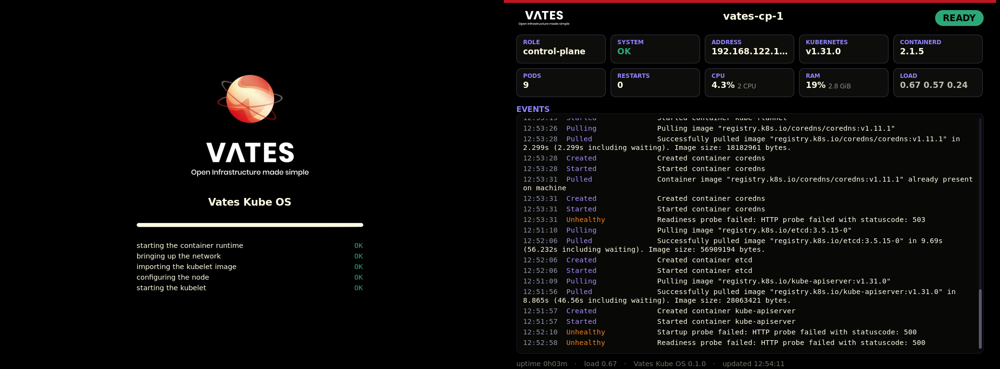

# Vates Kube OS

An **immutable** machine image whose only job is to run Kubernetes. Every
Kubernetes component is a container.



> [!WARNING]
> **Experimental — no support, not for production.**
> Vates Kube OS is a work in progress: it is **not supported** by Vates, and it
> is **not recommended for production use**. Expect breaking changes and data
> loss; evaluate it at your own risk.

The image is **built from source**, not from a distribution: **glibc, no
systemd, no SELinux, no package manager**, every component compiled from its
upstream source and pinned by sha256. `vates-sysinit` is PID 1; the screen is
the cairo + DRM console, preceded by a boot screen of our own.

> **What it is and how it works**: [`docs/ARCHITECTURE.md`](docs/ARCHITECTURE.md).
> **Build the image**: [`docs/BUILD.md`](docs/BUILD.md)
> (the builder's own reference: [`build/README.md`](build/README.md)).
> **Run a cluster**: [`docs/USAGE.md`](docs/USAGE.md).
> **Talk to a node**: [`docs/API.md`](docs/API.md).
> **Immutability and the binaries**: [`docs/IMMUTABILITY.md`](docs/IMMUTABILITY.md),
> [`docs/BINARIES.md`](docs/BINARIES.md).
> **Under Cluster API**: [`docs/CAPI.md`](docs/CAPI.md).

---

## At a glance

| | |
|---|---|
| **Base** | none — built from upstream sources: glibc, no systemd, no SELinux |
| **PID 1** | `vates-sysinit` — one of several small binaries (see `docs/BINARIES.md`) |
| **Container engine** | containerd (podman cannot serve the CRI) |
| **Control plane** | etcd, apiserver, scheduler, controller-manager, kube-vip — as *static pods*, started by the kubelet |
| **Configuration** | a single node document, written by the CAPI provider: the `vates-node.yaml` schema as the `user-data` (or as a `vates-node.yaml` file) on the config drive |
| **Kubernetes version** | chosen in `vates-node.yaml`, not in the image |
| **Kubernetes binary on the host** | none |
| **Bootloader** | systemd-boot (built without installing systemd) |
| **Console** | cairo + DRM, plus a boot screen (`vates-splash`) |

---

## Prerequisites

Building the image needs one thing: **podman** (or docker).

`make cluster` needs, on top of a built image:

- **libvirt + KVM** — `virsh`, the `default` network (192.168.122.0/24) and
  `/dev/kvm`;
- **kubectl** — it reads the cluster the node hands over;
- **qemu-img** — the per-VM overlays;
- **xorriso** — it writes the config-drive ISO for each machine;
- the **`qemu`** and **`libvirt`** groups for your user. The working tree is
  group-owned by `qemu` so the qemu user can walk to every config drive, and
  libvirt's polkit rule waives the password for `qemu:///system` for the
  `libvirt` group only. Both are read at login:

```bash
sudo usermod -aG qemu,libvirt "$(whoami)"   # then start a new session
```

`test/cluster.sh` checks both up front and prints the fix rather than failing
deeper.

A host **Go** is optional — `vateskctl` is built in a container when a runtime
is present. Everything else runs inside the build: the Fedora base is only the
seed compiler, and never enters the image.

---

## Building the image

```bash
make image
```

`make image` runs `build/build.sh disk`: a `Containerfile` driven by podman that
fetches every component from its upstream source (pinned by sha256 in
`build/pins.conf`), builds the C library, the userspace, the kernel and
systemd-boot **inside the build**, then lays down the GPT disk with
genimage. The disk lands in `build/out/` as `vates.qcow2` and `vates.vhd`. The
first build is long (it compiles glibc, the kernel and the console stack); later
ones are incremental, and adding a component does not rebuild the toolchain.
Details: [`build/README.md`](build/README.md).

The operator CLI, `vateskctl`, is a separate host artifact — it drives the
management API from your machine and is not part of the disk. Build it with
`make cli` (it lands in `build/bin/vateskctl`, and `make cluster` builds it the
same way) and install it with `make install`, which puts it under
`$(PREFIX)/bin`, `~/.local/bin` by default.

---

## Trying it

```bash
make cluster CP=1 WORKERS=0          # a single control plane
make cluster CP=3 WORKERS=3          # a real cluster
```

`make cluster` writes one config drive per machine and boots the VMs under
libvirt (visible in virt-manager). The machines join over the management API;
there is no SSH and no local login. `make cluster-status`, `make vip-failover`
and `make demo-app` complete the picture.

To run the image where the CAPI providers do — as a **Xen Orchestra VM
template** they clone — `make template` imports the built disk and turns it into
one, replacing the previous template of the same name (`NAME=... make template`
or a gitignored `.env`; `make cluster` can boot the same image). The conversion
uses XO's internal API for the final step, so it needs `xo-cli`; see
[`scripts/xo-template.sh`](scripts/xo-template.sh).

To bring one up by hand, without the script, and to understand what each step
does: [`docs/USAGE.md`](docs/USAGE.md).

---

## Cleaning up

```bash
make clean      # derived artifacts and test-VM state
make distclean  # + fetched sources and the podman build cache
```

The disk rebuilds incrementally; `distclean` starts the next build cold.

---

## The code

```text
cmd/vates-sysinit/     PID 1, the boot sequence and the first-boot configuration
cmd/vates-console/     the machine's screen: console + dashboard
cmd/vates-api/         the management API
cmd/vates-launcher/    fetch/verify/exec a Kubernetes binary (kubelet, kubeadm, kubectl)
cmd/vateskctl/         the operator's CLI
internal/sysinit/      PID 1 and the boot sequence
internal/firstboot/    configuring the node: kubeadm, kube-vip, the files to write
internal/firstboot/templates/   the YAML, embedded with go:embed
internal/console/      the machine's screen: console, dashboard, and splash
internal/launcher/     fetch, verify, cache and exec one Kubernetes binary
internal/api/          the management API: the gRPC service and its face
internal/console/tty/  the virtual-console primitives shared by boot and console
internal/update/ab/    the A/B slot policy, shared by PID 1 and the API
internal/update/imgsig/  verifying the image an update writes
internal/configdrive/  reading the NoCloud config drive
internal/dashboard/    collecting what the node knows about itself
internal/display/      the console's two faces: tui/ (text), gui/ (cairo + DRM)
internal/k8sbin/       where the Kubernetes binaries live and how they are named
internal/hostinfo/     what the machine knows about itself, from /proc and /etc
internal/kubeapi/      the Kubernetes client the console reads with
vatescfg/              the vates-node.yaml schema and its user-data encoder
image/                 what is baked into the image: default config, assets
build/                 the from-scratch builder: a Containerfile and its recipes
                       (build/README.md, build/pins.conf, build/recipes/, ...)
scripts/               host tooling (cleanup, config drives)
test/                  test tooling; test/fixtures/ = sources for the config drives
```

The binaries, and the measurements behind splitting them out of one multi-call
program: [`docs/BINARIES.md`](docs/BINARIES.md).

---

## Status

- [x] the image builds (`make image`) and boots; the kubelet talks to containerd
- [x] the `vates-node.yaml` schema, validated and tested
- [x] `vates-init` configures a **worker** and a **control plane** (kubeadm + kube-vip)
- [x] the `virsh` test cluster: 3 control planes + 3 workers, etcd with 3 voters,
      joins over the API, kube-vip moving the VIP on a power cut
- [x] the cairo + DRM console and the `vates-splash` boot screen
- [x] the disk **layout** immutability needs: `boot / rootA / rootB / var`, `/var`
      last and grown at boot when the hypervisor grows the disk, with the second
      root reserved now
- [x] immutability step 1: the root mounted read-only (`ro`), every path a node
      writes about itself moved under `/var`, verified by `test/ro.sh`
- [x] immutability step 2: the A/B switchover and boot-counted rollback, through
      the management API (`vateskctl ab status|switch`), verified by `test/ab.sh`
- [x] **one image, any Kubernetes version**: a launcher fetches the binary the
      node document asks for. The configuration supports **v1.31 and newer, with
      no ceiling** (the floor is kubeadm's `v1beta4` API), tested through v1.37
- [x] the document carries the **node name and the PKI** (`node.name`,
      `pki.clusterCA`, `pki.apiCA`), so the CAPI path — a `user-data` and no files
      — is complete; a bootstrapping control plane **reuses an injected cluster
      CA** instead of generating one
- [x] `make template`: the built disk becomes a **Xen Orchestra VM template** the
      CAPI providers clone (`scripts/xo-template.sh`)
- [ ] **TODO** — the updater, `vateskctl ab update`: write the inactive root, then
      switch. (Today the API only switches between two slots that both already
      hold a system.)
- [ ] immutability step 3: wire the verifier (`internal/update/imgsig`, done)
      into the updater; verified boot (`dm-verity`, signed UKI, Secure Boot) stays
      optional
- [ ] the VATES CAPI provider (its node-side prerequisite — the injected CA — is
      in place)

See [`docs/ARCHITECTURE.md`](docs/ARCHITECTURE.md) for the detail and
[`build/README.md`](build/README.md) for how the image is built.
