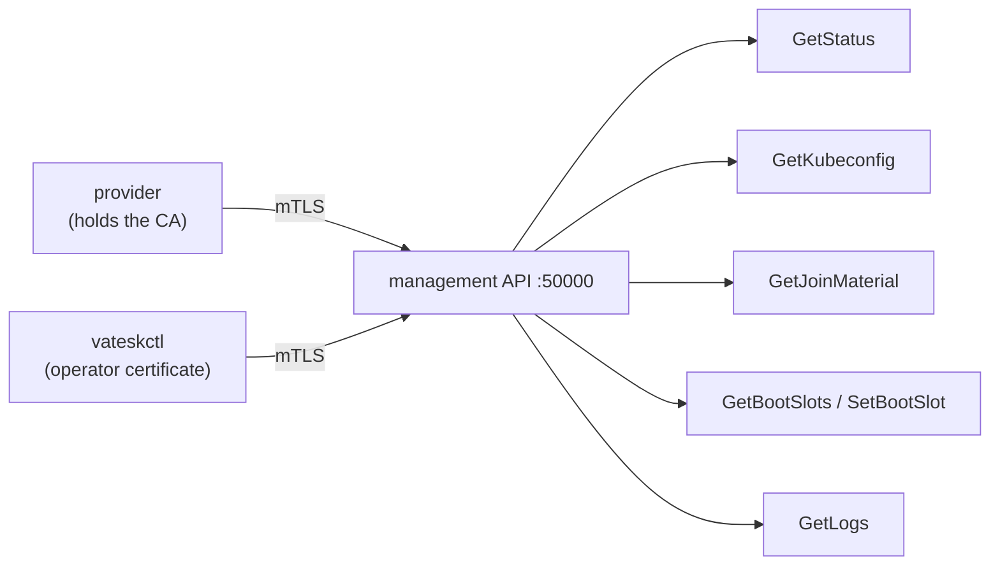

# The management API

A running node exposes one gRPC service, authenticated with mutual TLS. It is
what replaces SSH: the OS carries no shell and no `sshd`, so anything that needs
to ask a node something asks here.

For how a node gets configured and joins a cluster, see
[`ARCHITECTURE.md`](ARCHITECTURE.md) and [`USAGE.md`](USAGE.md).

## Shape

- **transport**: gRPC over **mutual TLS**;
- **port**: **50000** by default, configurable with `api.port` in the node
  document (and `vateskctl gen --api-port`);
- **server certificate**: the node's name, its addresses, loopback, and the
  **cluster endpoint** (the virtual IP an operator knows the cluster by, which
  the node does not have yet when the certificate is minted);
- **client certificates**: restricted by organization to `O=vates:admin` or
  `O=system:masters`. Every node certificate in the cluster is signed by the same
  authority, so without that restriction a kubelet's own certificate could call
  the API;
- **methods**: a fixed allow-list declared in `proto/vates/api/v1/api.proto`.
  There is no shell method, and there never will be.

## Who talks to it



## `vateskctl`

The operator's CLI runs off the node and authenticates with a certificate
generated for the cluster.

```bash
vateskctl status      --cluster <name>                      # the cluster endpoint
vateskctl kubeconfig  --cluster <name>                      # writes <dir>/kubeconfig
vateskctl join-material --cluster <name>                    # fresh join credentials

vateskctl status      --node <host:port> --cluster <name>   # one specific node
vateskctl ab status   --node <host:port> --cluster <name>   # which root it booted
vateskctl ab switch b --node <host:port> --cluster <name>   # boot the other root next
vateskctl logs        --node <host:port> --cluster <name>   # the node's own logs
```

Without `--node`, commands default to the cluster endpoint (the virtual IP) on
the management port.

## Two authorities, one at a time

- **with a provider**: the operator holds a kubeconfig whose client certificate
  the cluster CA signed. The API uses the cluster CA for both directions.
- **without a provider** (a node booted directly on KVM or any hypervisor): the
  node generated its cluster CA and never hands it out, so the operator
  generates a CA of its own:

  ```bash
  vateskctl gen --cluster my-cluster --endpoint 192.168.1.10:6443
  ```

  It writes, under `$XDG_DATA_HOME/vates/kube-clusters/my-cluster/`: `api-ca.crt`
  and `api-ca.key`, `client.crt`/`client.key`, and `client.kubeconfig`. The two
  `api-ca` files reach the node as config-drive files of the same name, or as
  `pki.apiCA` in the node document where there is no file channel. The node mints
  its **server** certificate from that CA; the operator verifies it with the same
  CA and calls the API with its client certificate. One authority covers both
  directions, and nothing is fetched from the node.

When both `api-ca.crt` and `api-ca.key` are present under `/etc/vates/`, they
replace the cluster CA entirely; one without the other is ignored.

> When `vateskctl` cannot find the credential, it says so and names the
> directory it looked in. `make cluster` keeps its material under the scratch
> tree with a non-default cluster name, so point `XDG_DATA_HOME` there (see the
> output of `make cluster`).

## Joining a machine

A machine joins from its config drive alone; the question is where the
credentials in that drive come from. They are signed or encrypted with the
cluster CA, so only a bootstrapped control plane holds them.

```bash
vateskctl join-material --cluster my-cluster
# TOKEN=... CERT_KEY=... CA_HASH=...
```

- a **worker** is given the cluster CA and a token: its kubelet obtains its own
  certificate through TLS bootstrap. No private key is placed on the drive.
- a joining **control plane** is given the token, the CA hash and the certificate
  key, and fetches the shared certificates from the cluster itself.

The values expire (the token in 24 h, the certificate key in two), so they are
fetched when a machine is about to be created, never stored.

## Switching roots (A/B)

A node has two root partitions and boots one of them; an update is written into
the other, and switching is moving the next boot to it. There is no shell on a
node, so this too is an API call:

```bash
vateskctl ab status --node 192.168.1.21:50000 --cluster my-cluster
vateskctl ab switch b --node 192.168.1.21:50000 --cluster my-cluster
```

`SetBootSlot` flips the boot order and marks the target a **trial**; the node
blesses it once the OS is up. A slot that never comes up has its boot counter run
down, sorts last, and the other root boots — the rollback, with no operator.
`SetBootSlot` does not write the slot: the caller writes the image first, or the
node would boot the old system again. See [`IMMUTABILITY.md`](IMMUTABILITY.md).

## Regenerating the proto

The generated code (`proto/vates/api/v1/*.pb.go`) is committed on purpose, so the
image build and `go build` never need `buf` or `protoc`. After editing the
`.proto`:

```bash
go install google.golang.org/protobuf/cmd/protoc-gen-go@latest
go install google.golang.org/grpc/cmd/protoc-gen-go-grpc@latest
go install github.com/bufbuild/buf/cmd/buf@latest
buf generate
```
