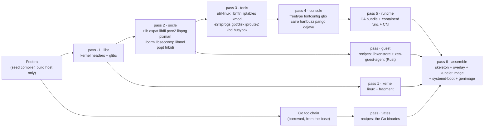

# Building the image

The image is built from **pinned upstream sources** by a `Containerfile` driven
by podman. Nothing is compiled on the host: the host needs **podman** (or
docker), and nothing else.

```bash
make image          # -> build/out/vates.qcow2 and build/out/vates.vhd
```

It is not built from a distribution and not from a meta build system: every
component is fetched from its own upstream project and pinned by sha256 in
[`build/pins.conf`](../build/pins.conf). The only borrowed piece is the **seed
compiler** — the gcc Fedora ships in the build image — and it never enters the
image.

## Where everything lives

```text
build/
  build.sh              the driver: fetch + verify sources, run podman, assemble the disk
  Containerfile         the passes, as container stages
  pins.conf             name|version|source-tarball|sha256|url, one line per component
  board/                kernel and busybox fragments (the options the node needs)
  overlay/              what is laid into the rootfs (our /etc, the udhcpc handler)
  genimage.cfg          the disk layout: ESP + rootA + rootB + /var
  lib/                  the build environment, the recipe helpers, the assembler
  recipes/<pass>/*.sh   one recipe per component
  README.md             the builder's own reference
  dl/  out/             fetched tarballs and the produced disk (gitignored)
```

## The build, as passes

One `Containerfile` stage per pass of the dependency graph. Each component is its
own `COPY` + `RUN`, so it caches on its own and changing one recipe rebuilds only
it and what follows.



Every component that is compiled is a **recipe**: `build/recipes/<pass>/<name>.sh`,
one `build()` that fetches the pinned component, builds it and installs it into
`/sysroot`. The `Containerfile` stages add nothing but a **borrowed toolchain** —
the seed C compiler, the Go compiler, Rust — and the source, then
`COPY` + `RUN run-recipe.sh <name>`, one cache layer per component. Programs are
recipes too (`busybox`, `e2fsprogs`, the kernel, the `vates` Go binaries, and the
Rust Xen guest agent); the only thing outside that rule is **assembly** —
`assemble.sh` and genimage — because it compiles nothing. `libxenstore`, the C
library the Rust agent links, is a recipe of its own (`recipes/guest/xenstore.sh`),
built from the Xen source into `/sysroot`.

A recipe defines a single `build()` function:

```sh
# recipes/socle/expat.sh
build() {
    autotools_build expat \
        --with-dev-urandom \
        --without-docbook --without-examples --without-tests --without-xmlwf
}
```

`build/lib/common.sh` provides the helpers: `fetch` (downloads the pinned tarball
and **verifies its sha256**), `unpack`, `autotools_build`, `meson_build`.

## Adding or bumping a component

1. add or edit its line in [`build/pins.conf`](../build/pins.conf);
2. write `build/recipes/<pass>/<name>.sh` with a `build()` function;
3. add two lines to the right stage of the `Containerfile`:
   ```dockerfile
   COPY recipes/<pass>/<name>.sh /build/recipes/<pass>/<name>.sh
   RUN /build/lib/run-recipe.sh <name>
   ```
4. `make image` — only the new component and what follows it rebuild.

A recipe may only use what the passes **before** it installed.

## Built here, or borrowed

| Piece | Origin |
|---|---|
| glibc | **built here**, from the GNU source |
| kernel, busybox, util-linux, the console stack, containerd's userspace | **built here** (or from upstream release binaries) |
| the `vates` binaries (Go) | **built here**, from this repository's own source |
| the Xen guest agent (Rust) | **built here** from `xen-project/xen-guest-agent`, replacing the Go `xe-guest-utilities` |
| containerd, runc, the CNI plugins | upstream **release binaries** |
| systemd-boot | **built here** from the systemd source, without installing systemd |
| the seed compiler and its runtime | **borrowed** from the build image, **not shipped** |

The rule is explicit: **own the C library, borrow the compiler.** The libc is what
ships, so its version and its build are ours; the compiler is a build tool, and
bootstrapping a toolchain would cost most of the build for nothing the image
carries.

## From `/sysroot` to the disk

`build/lib/assemble.sh` turns the built userspace into a bootable disk. It is not
a `RUN` in the `Containerfile`: `build.sh` runs it with `build/out` mounted, so
the disk is written straight to the host and never becomes a layer. In order: the
directory skeleton, the `vates` binaries, the overlay and assets, the kubelet
image, iptables names pointed at nftables, a trim + strip pass, `rootfs.ext4`, the
ESP with systemd-boot and its A/B entries, and finally `genimage`, which lays the
GPT disk — `ESP + rootA + rootB + /var`, with `/var` last and grown at boot.

## Running it

```bash
make image              # the whole disk (build/out/vates.qcow2)
make follow             # tail the build log from another terminal
```

A single stage, from `build/`:

```bash
./build.sh socle        # one pass (the default)
./build.sh console
./build.sh kernel
```

The first build is long — it compiles glibc, the kernel and the console stack;
order of magnitude: tens of minutes. Later builds are incremental. The base image
is Fedora; override with `VATES_SCRATCH_BASE`.

```bash
make clean      # remove the produced disk and staged content
make distclean  # also drop fetched sources and the build cache
```

To publish the disk as a **Xen Orchestra VM template** — what the CAPI providers
clone — `make template` imports `build/out/vates.vhd`, creates a UEFI VM, attaches
the disk, converts it to a template, and replaces the previous one of the same
name. Values (`XO_URL`, `XO_TOKEN`, `XO_POOL`, `XO_SR`, `NAME`, `VHD`) come from a
gitignored `.env`, and an environment variable overrides the file. The final
conversion uses XO's internal JSON-RPC API (the REST API cannot set
`is_a_template`), so the script needs `xo-cli`; see
[`scripts/xo-template.sh`](../scripts/xo-template.sh).

## Testing and diagnosing

```bash
make cluster CP=1 WORKERS=0   # a single control plane on the built image
make cluster CP=3 WORKERS=3   # a real cluster
```

When a machine does not come up, the node says *why*: the console shows PID 1's
last step, and `vateskctl logs` returns the tail of PID 1's log and each
service's. `make cluster` calls it automatically when a machine never becomes
Ready. See [`USAGE.md`](USAGE.md).

For the builder's own reference — the recipes, the overlay, the assembler's
details — see [`build/README.md`](../build/README.md).
