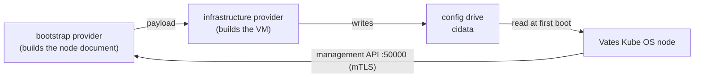

# Running under Cluster API

Vates Kube OS is written to be driven by [Cluster API](https://cluster-api.sigs.k8s.io/)
(CAPI). This page is for someone wiring the two together: what the OS expects,
and what your provider has to produce.

Nothing here is required to run a cluster by hand — it is the integration
contract.

## The split

CAPI separates two concerns, and Vates honours exactly that split:

| CAPI object | concern | what it produces here |
|---|---|---|
| a **bootstrap** provider | how a machine becomes a node | the **config drive contents**: the node document, the name, the credentials |
| an **infrastructure** provider | the VM it runs on | the **VM**: OS disk, firmware, vGPU, NIC, and the config drive attached read-only |

The seam is the **config drive**. The bootstrap provider never talks to the
hypervisor, and the infrastructure provider never decides what the node *is*.



## What the infrastructure provider must give the VM

Hard requirements, not preferences:

- **UEFI.** The disk boots through systemd-boot on the ESP.
- **A disk larger than the image.** The layout is `ESP + rootA + rootB + /var`,
  and `/var` is last on purpose: it is what the node grows to fill a grown disk.
  A VM whose disk equals the image size has a `/var` too small and the kubelet
  dies fetching its binaries.
- **A config drive labelled `cidata`**, attached read-only, before first boot.
- **A vGPU** if you want the graphical console; without one the node still runs
  and falls back to the serial console.

The disk image, the firmware and the vGPU are infrastructure fields. The config
drive contents are bootstrap fields. Keeping that line is what lets the same node
document serve a machine on any hypervisor.

## What the bootstrap provider produces

One document per machine: the **`vates-node.yaml` schema** (see
[`ARCHITECTURE.md`](ARCHITECTURE.md)). It is delivered in the machine's
**`user-data`** slot, as-is — a hypervisor gives a VM no other channel, and the OS
reads the document there. A `vates-node.yaml` file works too on a hand-built
drive; `user-data` wins when both are present.

The schema is a Go package, [`vatescfg`](../vatescfg/config.go), importable by
your provider so the two cannot drift:

```go
import "github.com/vatesfr/vates-kube-os/vatescfg"

userData, err := cfg.UserData()   // the bytes to put in the bootstrap Secret
```

The **node name** is stated by the bootstrap provider in the document
(`node.name`), because it is the one that knows the CAPI `Machine` name. A
hypervisor's `meta-data` (`local-hostname`) is the fallback, for a hand-built
drive that states no name; a node needs one of the two.

## What the provider does at reconcile time

1. build the `vatescfg.Config` from the CAPI objects (role, version, endpoint,
   VIP, network, CNI, and — for a joining machine — fresh join material);
2. `cfg.UserData()` and publish it as the bootstrap data Secret;
3. the infrastructure provider attaches it as the `cidata` drive and starts the
   VM;
4. once the VM is up, poll its **management API** on port 50000:

| method | use |
|---|---|
| `GetStatus` | readiness, and the node's name, role and version |
| `GetKubeconfig` | store the cluster kubeconfig where `clusterctl get kubeconfig` reads it |
| `GetJoinMaterial` | fresh `token`, `certificate_key`, `ca_cert_hash` for a joining machine |
| `GetBootSlots` / `SetBootSlot` | A/B OS update: which root booted, and move the next boot |

`GetJoinMaterial` values expire (the token in 24 h, the certificate key in two),
so fetch them when a machine is about to be created — never store them.

## Trust

The management API is mutual TLS: the CA signs the node's server certificate and
verifies the client. A client is admitted only with `O=vates:admin` or
`O=system:masters`, so a kubelet's own certificate cannot call it.

- **under CAPI**, the provider holds a kubeconfig whose client certificate the
  cluster CA signed;
- **without CAPI** (a node booted directly on KVM or any hypervisor), the
  operator generates its own CA and injects it into the node's drive — see
  [`API.md`](API.md).

## Where the current bootstrap provider stands

A bootstrapping control plane currently generates its own cluster CA, so a
provider can *fetch* it (through `GetKubeconfig`) but does not hold the private
key. Joining machines are therefore served through `GetJoinMaterial`, from a live
control plane. Injecting the CA into the bootstrapping node — so the provider
issues everything itself — is the direction of travel, and the interface is
planned to make that a one-line switch.
