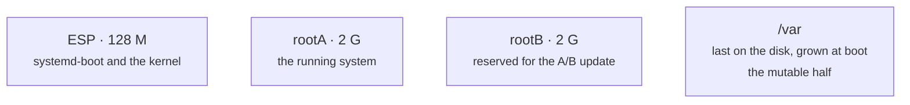

# Immutability

An immutable OS is one whose system files cannot be changed in place, whose
updates replace the whole system atomically, and which can roll back. That is
what this image aims at, and it shapes a decision — the disk layout — that
cannot wait, because a node already deployed cannot have its partition table
rearranged.

## What "immutable" means here

Three properties:

1. the OS does not modify itself in place — a process cannot write to the system
   files and persist there;
2. an update replaces the whole system, atomically: either the old or the new,
   never a mix;
3. a node can roll back without reinstalling.

It does **not** mean a machine with no state. A node keeps its certificates, its
containers and its volumes: that state is the machine, not a side effect.

## The disk layout

- **`/var` is last, for good.** A hypervisor grows a machine by growing its disk,
  and only the last partition can absorb the space. So the grow lands on `/var`,
  where the containers, the kubelet state and the volumes live — none of the
  frozen system.
- **`rootB` is reserved now, not later.** A second root must sit before `/var`;
  inserting it later would push `/var` off the end and break the grow on every
  node already deployed.

## What stays writable

The system files are frozen; the machine's own state is not. Everything a node
writes at runtime lives under `/var`, and the `/etc` paths it writes are
symlinks into `/var`:

| path | why |
|---|---|
| `/var/lib/containerd`, `/var/lib/containers` | images and containers |
| `/var/lib/kubelet` | the kubelet state, the pod volumes |
| `/var/lib/vates` | the binary cache, the node's identity |
| `/etc/kubernetes` → `/var/lib/vates/etc/kubernetes` | the node's certificates and kubeconfigs |
| `/etc/vates` → `/var/lib/vates/etc/vates` | the management API's certificates |
| `/opt/cni/bin`, `/etc/cni/net.d` | written by the chosen CNI (an overlay, its upper layer on `/var`) |
| `/run`, `/tmp` | everything else, gone on reboot |

The rule: **what must survive is identity, not software.**

## Where it stands

| Step | Mechanism | Status |
|---|---|---|
| 1 | `/` read-only, `/var` on its own partition | done, verified (`test/ro.sh`) |
| 2 | A/B roots, switchover, boot-counted rollback | switchover and rollback done (`test/ab.sh`); the updater is not |
| 3 | verify the image at update time | planned |

`/` is mounted read-only by the kernel, and PID 1 does not trust the mount
option: at boot it **tries to write** to `/` and records the result (`EROFS`),
which `test/ro.sh` reads back off the disk.

Step 2's mechanism is driven through the management API: systemd-boot sorts the
two boot entries, `SetBootSlot` flips the order and marks the target a trial,
and a slot that never comes up runs its counter down and sorts last — the
rollback is the sort. See [`API.md`](API.md).

## What is left

The **updater** — the verb that fetches an OS image and writes it into the
inactive root before switching (`vateskctl ab update`), and the verification of
that image. Today the API can only switch between two roots that both already
contain a system. The updater is tracked in the [`README`](../README.md).
