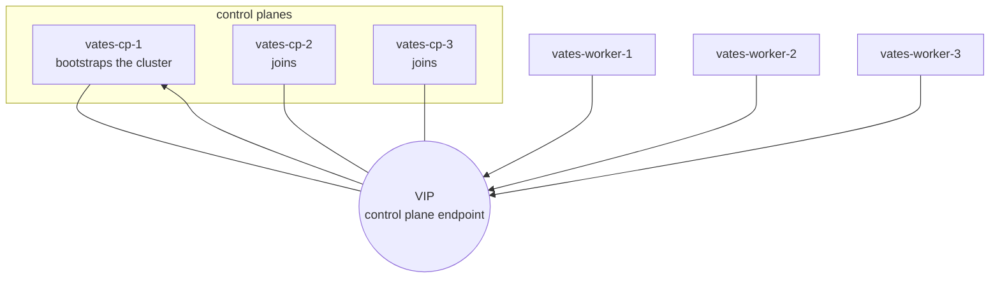

# Running a cluster

This page brings up a real cluster on the machine you are on, using libvirt and
KVM. It is the fastest way to see the OS work end to end: one control plane, or
three control planes and three workers, started from a single built image.

## Prerequisites

Besides a built image (`make image`, see [`BUILD.md`](BUILD.md)):

- **libvirt + KVM** — `virsh`, the default network (`192.168.122.0/24`) and
  `/dev/kvm`;
- `kubectl`, `qemu-img`, `xorriso`;
- your user in the **`qemu`** and **`libvirt`** groups:

```bash
sudo usermod -aG qemu,libvirt "$(whoami)"   # then start a new session
```

`test/cluster.sh` checks these up front and prints the fix rather than failing
deeper.

## Bring it up

```bash
make cluster CP=1 WORKERS=0     # a single control plane
make cluster CP=3 WORKERS=3     # a real cluster
```

Each machine gets its own **config drive** (its node document) and boots under
libvirt, visible in `virt-manager`. There is **no SSH**: the machines join the
cluster and are managed over the management API.



The first control plane creates the cluster. The others and the workers join it:
they read their config drive, and get their credentials through the management
API or through the cluster CA on the drive. See
[`ARCHITECTURE.md`](ARCHITECTURE.md) and [`API.md`](API.md).

## The three roles

| role | what it does |
|---|---|
| control plane, first | generates the cluster's certificate authority, runs `kubeadm init`, owns the virtual IP |
| control plane, joining | fetches the shared certificates with a certificate key, then `kubeadm join --control-plane` |
| worker | runs no `kubeadm`: its kubelet presents a token and obtains its own certificate (TLS bootstrap) |

## Watch it

```bash
make cluster-status     # nodes, pods, and the management API endpoint
make cluster-wait       # wait until every machine is Ready
make vip-failover       # power off the control plane holding the VIP, time the takeover
make demo-app           # deploy a small app and check it serves
```

A node has no shell. To see what a machine is doing, read its own logs:

```bash
build/bin/vateskctl logs --node <ip>:50000 --cluster <name>
```

That returns the tail of PID 1's log (including which config source the node
read) and each service's. `make cluster` calls it automatically when a machine
never becomes Ready. `make cluster` keeps its operator material under the scratch
tree: point `XDG_DATA_HOME` at it (and use the right cluster name) when you call
`vateskctl` by hand — see [`API.md`](API.md).

## Tear it down

```bash
make cluster-down       # remove every vates-* machine
make clean              # also the generated drives and test-VM state
make distclean          # + the fetched sources and the build cache
```

## Doing it by hand

`test/cluster.sh` is the working reference for everything above — how the drives
are written, how the machines are started, how the join material is fetched. It
is short enough to read, and it is the executable version of this page.
